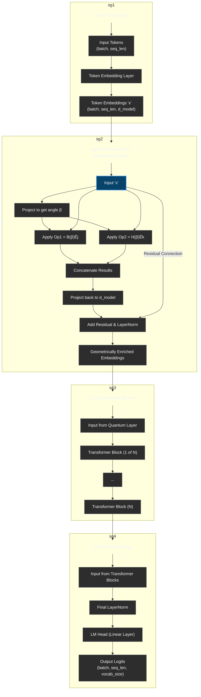

# QuantumGPT: A Transformer Model with a Matrix-Geometric Embedding Layer

This repository contains the PyTorch implementation of **QuantumGPT**, a generative pre-trained transformer model that replaces standard positional encodings with a novel `QuantumGeometricEmbedding` layer. This layer is directly inspired by the theoretical framework presented in the paper *"The Matrix-Geometric Origin of Quantum Reality"* by Bhargav Patel.

The core idea is to construct richer, more structured token embeddings by applying data-dependent geometric transformations derived from real-valued rotation matrices, which are proposed as the origin of complex numbers in quantum mechanics.

## Key Concepts

The standard GPT architecture combines token embeddings with sinusoidal positional encodings. QuantumGPT replaces this with a dynamic, learned process:

1.  **Geometric Foundation**: Instead of simple position addition, the `QuantumGeometricEmbedding` layer treats the token embedding vector `x` as a set of coordinates in multiple 2D planes.
2.  **Emergence Operators**: The layer implements the paper's **Generalized Emergence Operator** by applying two distinct geometric transformations in parallel:
    - **Operator 1**: `B(β)Êj`
    - **Operator 2**: `H(β)Êk`
    where `B(β)` and `H(β)` are emergence/complementary operators, and `Êj`, `Êk` are fundamental 2x2 rotation matrices satisfying `Êj² = Êk² = -I`.
3.  **Data-Dependent Rotations**: The rotation angle `β` is not fixed but is learned dynamically from the input token embedding itself, allowing the model to create context-specific geometric structures.
4.  **Enriched Embeddings**: The outputs of these parallel transformations are concatenated, projected, and combined with a residual connection. This produces a geometrically enriched embedding that is then fed into a standard stack of transformer blocks.

The hypothesis is that this structured, geometric "preprocessing" of embeddings can lead to more efficient learning, better representation of complex relationships, and potentially improved model performance.

## Architecture Diagram


## Installation

To get started, clone the repository and install the required dependencies (primarily PyTorch).

```bash
# Clone the repository
git clone https://github.com/your-username/quantum-gpt.git
cd quantum-gpt

# Install dependencies (it's recommended to use a virtual environment)
pip install torch
```

## Usage

The main model is defined in `quantum_gpt.py`. You can import `QuantumGPT` and use it like any other PyTorch `nn.Module`.

### 1. Model Instantiation

First, define the model configuration and create an instance of `QuantumGPT`.

```python
import torch
from quantum_gpt import QuantumGPT

# --- Model Hyperparameters ---
config = {
    'vocab_size': 50257,  # Example: GPT-2 vocab size
    'd_model': 768,       # Must be even for the quantum layer
    'n_layer': 12,
    'n_head': 12,
    'd_ff': 768 * 4,
    'dropout': 0.1,
    'max_seq_len': 1024,
}

# --- Instantiate the Model ---
model = QuantumGPT(**config)
print(f"QuantumGPT model initialized with {model.count_parameters():,} parameters.")

# Move model to GPU if available
device = 'cuda' if torch.cuda.is_available() else 'cpu'
model.to(device)
```

### 2. Forward Pass

You can run a forward pass with dummy data to see it in action.

```python
# --- Create Dummy Data and Run a Forward Pass ---
batch_size = 4
seq_len = 128
dummy_input = torch.randint(0, config['vocab_size'], (batch_size, seq_len)).to(device)
dummy_targets = torch.randint(0, config['vocab_size'], (batch_size, seq_len)).to(device)

print(f"\nRunning a forward pass with input shape: {dummy_input.shape}")

# Get logits and loss
logits, loss = model(dummy_input, targets=dummy_targets)

print(f"Output logits shape: {logits.shape}")
if loss is not None:
    print(f"Calculated loss: {loss.item():.4f}")

# Example of generating text (without targets)
logits, _ = model(dummy_input)
print(f"Generation logits shape: {logits.shape}")
```

### 3. Training Loop

The model can be integrated into a standard PyTorch training loop.

```python
# (Assuming you have a dataloader)
optimizer = torch.optim.AdamW(model.parameters(), lr=1e-4)

model.train()
for epoch in range(num_epochs):
    for batch in dataloader:
        inputs, targets = batch
        inputs, targets = inputs.to(device), targets.to(device)

        # Zero gradients
        optimizer.zero_grad()
        
        # Forward pass
        logits, loss = model(inputs, targets=targets)
        
        # Backward pass and optimization
        loss.backward()
        optimizer.step()

        print(f"Epoch {epoch+1}, Loss: {loss.item()}")
```
## Future Work & Experiments

This implementation serves as a proof-of-concept. Potential areas for further research include:

-   **Empirical Evaluation**: Training `QuantumGPT` and a standard GPT baseline of identical size on a benchmark dataset (e.g., TinyStories, OpenWebText) to compare perplexity, convergence speed, and downstream task performance.
-   **Ablation Studies**:
    -   Compare the performance of the full `B(β)Êj + H(β)Êk` model against models using only one of the operators.
    -   Analyze the effect of making the rotation angle `β` a static hyperparameter versus a learned, data-dependent value.
-   **Exploring Different Geometries**: The paper's framework is general. One could experiment with other 2x2 matrices for `Êj` and `Êk` that satisfy the required algebraic constraints.
-   **Scaling Laws**: Investigate if the scaling laws for `QuantumGPT` differ from those of standard transformers.

## Support & Donations

If you find this project interesting or useful, please consider supporting its development. Your contribution helps in maintaining the project and exploring new research directions.

[](https://github.com/sponsors/bhargavpatel431997)

## Citation

If you use this work, please consider citing the original paper that inspired this architecture:

> Patel, B. (2025). *The Matrix-Geometric Origin of Quantum Reality: Universal Emergence Through Real Rotation Matrices and a New Paradigm for Quantum Computing*.

## License

This project is licensed under the MIT License. See the `LICENSE` file for details.
