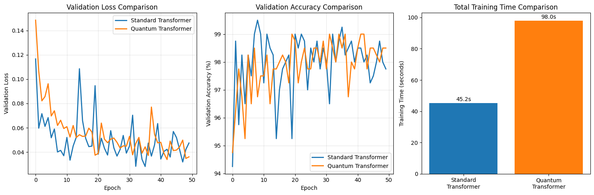

# Quantum-Inspired Complex Transformers

[](https://opensource.org/licenses/MIT)
[](https://www.python.org/downloads/release/python-390/)
[](https://pytorch.org/get-started/locally/)

This repository contains the official PyTorch implementation and benchmark code for the paper: **"Quantum-Inspired Complex Transformers: A Novel Algebraic Framework for Enhanced Parameter Efficiency"**.

We introduce the Quantum-Inspired Complex (QIC) Transformer, a novel architecture that operates on a learnable, quantum-inspired algebraic system. Instead of using standard real numbers, our model uses a two-component algebra where the foundational rule is governed by a learnable phase parameter, $\theta$. This allows the model to dynamically adapt its own arithmetic to best solve a given problem, leading to significant gains in parameter efficiency and performance.

## Key Features

*   **Novel Learnable Algebra:** Implements a new form of complex arithmetic where the imaginary unit $J(\theta)$ follows the rule $J(\theta)^2 = -1 + \sin(2\theta)$, allowing the model to learn its own mathematical structure.
*   **Superior Parameter Efficiency:** Achieves **higher accuracy with ~21% fewer parameters** than a standard Transformer baseline.
*   **State-of-the-Art Components:** Integrates modern Transformer techniques like Rotary Positional Embeddings (RoPE), SwiGLU, and Multi-Head Attention, all re-engineered to operate within the QIC algebraic domain.
*   **Full Reproducibility:** Provides a single, self-contained script to reproduce the paper's benchmark results.

## Performance Highlights

The QIC Transformer demonstrates a clear trade-off: superior performance and efficiency at the cost of increased computational time. This makes it a compelling architecture for applications where model size and accuracy are critical.

| Metric                        | Standard Transformer | QIC Transformer              | Delta                        |
| ----------------------------- | -------------------- | ---------------------------- | ---------------------------- |
| **Total Trainable Parameters**| 21,570               | **17,048**                   | **-20.96%** (Fewer is better) |
| **Final Validation Accuracy** | 97.75%               | **98.50%**                   | **+0.75%**                   |
| **Final Validation Loss**     | 0.0475               | **0.0361**                   | **-24.0%** (Lower is better)  |
| **Total Training Time**       | 45.24 sec            | 98.04 sec                    | +116.7% (2.17x slower)       |


*Figure 1: Comparison of validation loss, validation accuracy, and training time over 50 epochs on a sequence classification task.*

## Alternative J(theta) Interpretation benchmark2 Results (Models Compared)

Three models were benchmarked on a binary classification task:

1.  **Standard Transformer (Baseline)**: A conventional Transformer model with standard embedding and attention layers.
    -   Parameters: 21,602
    -   Embedding Dimension: 32

2.  **Matrix QC Transformer**: A variant where linear layers are replaced by learnable 2x2 matrices that are initialized to the `J(θ)` form. The model is free to learn any 2x2 matrix, testing if the `J(θ)` structure is a good starting point.
    -   Parameters: 17,109
    -   Embedding Dimension: 20

3.  **J(θ) Transform Transformer**: A more constrained variant where the transformation is explicitly defined by the `J(θ)` matrix. The model only learns the scalar parameter `θ` for each transformation, significantly reducing the number of parameters compared to a full matrix.
    -   Parameters: 17,392
    -   Embedding Dimension: 20

## Benchmark Results

The models were trained for 50 epochs on a binary classification task. The following image summarizes the key performance metrics.


### Overall Performance Summary

| Model              | Best Accuracy | Parameter Count | Parameter Reduction | Training Time (CPU) |
| ------------------ | :-----------: | :-------------: | :-----------------: | :-----------------: |
| Standard           |    99.50%     |     21,602      |        0.0%         |       40.5s         |
| Matrix QC          |    99.25%     |  17,109 (0.79x) |        20.8%        |   96.2s (2.37x)     |
| **J(θ) Transform** |  **99.75%**   |  **17,392 (0.81x)** |      **19.5%**      |  **105.2s (2.60x)** |

### Analysis

1.  **Accuracy and Loss (Top Row)**
    -   The **`J(θ) Transform`** model achieves the **highest best validation accuracy (99.8%)** and the **lowest final validation loss**.
    -   All models show some volatility in validation accuracy, but the training curves are stable, indicating successful learning.

2.  **Parameter Efficiency (Middle Row & Bottom Right)**
    -   Both quantum-inspired models achieve their results with **~20% fewer parameters** than the standard baseline.
    -   The **`Parameter-Accuracy Trade-off`** plot clearly shows the superiority of the `J(θ) Transform` model: it occupies the ideal top-left position, representing the highest accuracy for a low number of parameters.
    -   While the `Matrix QC` model is slightly more parameter-efficient than `J(θ) Transform`, it fails to achieve the same level of accuracy.

3.  **Training Time (Middle Right)**
    -   The improved efficiency comes at a significant computational cost. The quantum-inspired models are **~2.5x slower** to train on a CPU. This is likely due to the custom operations being less optimized than the highly-tuned matrix multiplications used in standard libraries.

### Analysis of Learned `θ` Parameters

A key insight comes from inspecting the learned `θ` values in the quantum models. The value `θ = π/4 ≈ 0.7854` is a special point where `sin(θ) - cos(θ) = 0`. At this value, the `J(θ)` matrix becomes the zero matrix, effectively "turning off" the transformation.

## Installation

A virtual environment is strongly recommended to avoid conflicts with existing packages.

```bash
# 1. Clone the repository
git clone https://github.com/bhargavpatel431997/quantum-inspired-complex-qic-transformer.git
cd quantum-inspired-complex-qic-transformers

# 2. Create and activate a virtual environment
python -m venv venv
source venv/bin/activate  # On Windows, use `venv\Scripts\activate`

# 3. Install the required dependencies
pip install -r requirements.txt
```

## Reproducing the Benchmark

This repository is designed around a single, self-contained benchmark script: `benchmark_comparison.py` (or your script's actual name). This script will automatically:
1.  Configure a standard Transformer and a parameter-matched QIC Transformer.
2.  Build a synthetic dataset for a sequence classification task.
3.  Train both models on the CPU for a fair comparison of computational steps.
4.  Print a detailed performance report to the console.
5.  Generate and save `transformer_benchmark_results.png` comparing the models.

To run the complete benchmark and reproduce the results from the paper, execute the following command from the root of the repository:

```bash
python benchmark_comparison.py
```
*(Note: Please ensure you have activated your virtual environment first.)*

## Code Structure

The `benchmark_comparison.py.py` file is organized into several logical parts for clarity:
-   **Part 1: Quantum Complex Arithmetic:** Core functions `qc_add` and `qc_bmm` that define the novel algebra.
-   **Part 2: QIC Transformer Modules:** Custom PyTorch modules (`QComplexDense`, `QComplexAttention`, etc.) that use the QIC algebra.
-   **Part 3: Standard Transformer Implementation:** Baseline modules for a fair comparison.
-   **Part 4: Complete Models:** The final `StandardTransformer` and `QTransformerClassifier` models.
-   **Part 5-7: Benchmark & Training:** Configuration, dataset, training loops, and the main `run_benchmark` function.

## Arxiv Endorsement Open Request
If you find it interesting and would you like to endorse me for this work then it would be very beneficial for me: https://arxiv.org/auth/endorse?x=SFGC9C
## Citation

This work is submitted to JMLR journal, If this work is accepted for publication, we will provide an appropriate citation. For now, please refer to it by the paper title and authors.

```
Patel, Bhargav. "Quantum-Inspired Complex Transformers: A Novel Algebraic Framework for Enhanced Parameter Efficiency."
```

## Acknowledgements & Support

This research was conducted independently. If you find this project interesting or useful, please consider [sponsoring its development](https://github.com/sponsors/bhargavpatel431997). Your support helps in maintaining the project and exploring new research directions.

## License

This project is licensed under the MIT License. See the `LICENSE` file for details.
